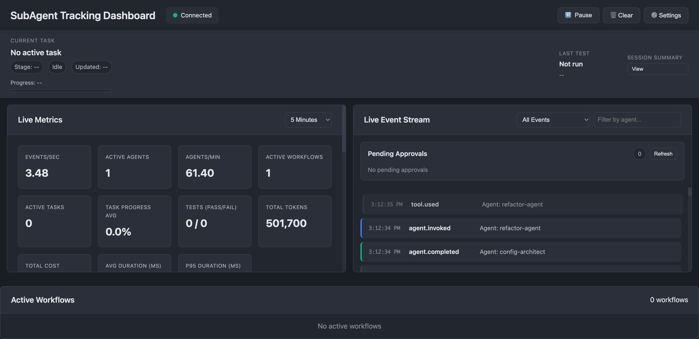

# 🛰️ SubAgent Tracking System

> **Git for AI agents.** A neutral observability, governance, and recovery layer for multi-agent AI coding workflows — so agent runs are *trackable, recoverable, and safe to operate*.

<p align="left">
  
  
  <a href="https://github.com/jcmd13/subAgentTracking/actions/workflows/ci.yml"></a>
  
  
</p>

When you orchestrate AI agents to write code, the moment a session crashes or hits a token limit, **everything is gone** — the plan, the context, the reasoning, the half-finished work. There's no audit trail, no cheap way to resume, and no guardrails around what an agent is allowed to touch. SubAgent Tracking fixes that: it records every agent action to an append-only log, snapshots state for instant recovery, routes work across LLM providers under a budget, and gates risky operations behind a permission + approval layer — all observable live in a WebSocket dashboard.

---

## The problem it solves

Multi-agent coding workflows are **hard to audit, hard to recover, and hard to govern.**

- 💥 **Lost context** — a crash or token limit wipes the session; the next run starts from zero.
- 🔍 **No audit trail** — which agent did what, why, with which tools, at what cost? Unknown.
- 🚧 **No guardrails** — agents can touch any file, run any command, call any model, spend any amount.
- 🔁 **Expensive resumes** — rebuilding context means replaying the full history, burning tokens.

This system creates **one common layer** underneath your agents that makes runs observable, replayable, and policy-aware.

## What you get

| Pillar | What it means |
|---|---|
| 👁️ **Observe** | Append-only JSONL activity log of every invocation, tool call, file op, decision, and error → ingested into a SQLite analytics DB → streamed live to a WebSocket dashboard. |
| 🛡️ **Govern** | Tool/path/network permission profiles, a policy-aware tool proxy, risk-scored human-in-the-loop approvals, and quality gates (secret scan, diff review, test protection). |
| 🧭 **Orchestrate** | Agent lifecycle management, complexity-scored model routing across providers with automatic fallback, and token/time/cost budgets enforced per agent. |
| ⏪ **Recover** | Periodic state snapshots + session handoff summaries → resume a crashed session from a compact checkpoint instead of replaying the entire history. |

## 📊 By the numbers

| | |
|---|---|
| **70** source modules, ~28k lines of production Python | **793** tests · **790 passing**, 3 skipped, 0 failing |
| **4** LLM providers (Anthropic · Gemini · Ollama · OpenAI) | **7** MCP tools for Claude Code / MCP clients |
| **Sub-millisecond** event logging (<1ms/event, >1k events/s) | **5** layers: core · orchestration · observability · adapters · MCP |
| Local-first storage with optional Google Drive backup | One-shot **Proxmox + systemd** deployment |

> 💡 **The core idea:** recovery reads a compact JSON snapshot instead of replaying the full activity log. The design target is to turn a ~150k-token session resume into an ~8k-token one — context cost you pay once, not every time something breaks.

---

## 🖥️ The real-time dashboard

Live multi-agent telemetry streamed over a WebSocket — connection state, rolling metrics (events/sec, active agents, tokens, cost, p50/p95/p99 latency), live charts, and a filterable event feed.



> Captured live: five agents (config-architect, refactor-agent, test-engineer, security-auditor, doc-writer) streaming `agent.invoked` / `tool.used` / `agent.completed` events through the bus.

---

## 🚀 Quick start

```bash
# 1. Install
python -m venv venv && source venv/bin/activate
pip install -r requirements.txt
pip install -e .

# 2. Initialize the data directory (.subagent/)
subagent init

# 3. See system status (add --watch for a live view)
subagent status
```

Minimal integration into your own agent loop:

```python
from src.core.activity_logger import log_agent_invocation

log_agent_invocation(
    agent="config-architect",
    invoked_by="orchestrator",
    reason="Task 1.1: implement structured logging",
)
# Snapshots, analytics ingestion, and (if configured) backups happen automatically.
```

Watch it live:

```bash
subagent monitor start      # WebSocket event stream
subagent dashboard start    # browser dashboard on top of the stream
```

---

## 🏗️ Architecture

Everything is **event-driven**. Agent actions emit events onto an in-process **event bus**; independent subscribers persist, analyze, snapshot, and stream them. Subsystems stay decoupled — you can add a subscriber without touching the producers.

```
                         ┌─────────────────────────────────────────────┐
   Agent / Tool / CLI    │                 EVENT BUS                     │
   actions ───────────►  │            (async pub/sub, in-process)        │
                         └───┬───────┬───────────┬───────────┬──────────┘
                             │       │           │           │
                  ┌──────────▼─┐ ┌───▼──────┐ ┌──▼────────┐ ┌▼────────────┐
                  │  Activity  │ │ Analytics│ │ Snapshot  │ │ Real-time   │
                  │  Logger    │ │ DB       │ │ Manager   │ │ Monitor     │
                  │ (JSONL)    │ │ (SQLite) │ │ (JSON)    │ │ (WebSocket) │
                  └──────┬─────┘ └────┬─────┘ └────┬──────┘ └──────┬──────┘
                         │            │            │               │
                  ┌──────▼─────┐  ┌───▼────────┐ ┌─▼─────────┐ ┌───▼────────┐
                  │  Backup    │  │ Analytics  │ │ Handoff   │ │ Dashboard  │
                  │ (G-Drive)  │  │ + Insight  │ │ summaries │ │ (browser)  │
                  └────────────┘  │ Engines    │ └───────────┘ └────────────┘
                                  └────────────┘
```

### Three-tier storage (local-first)

| Tier | Holds | Notes |
|---|---|---|
| **Local** (`.subagent/`) | JSONL logs, JSON snapshots, SQLite analytics, handoffs, quality + approval state | Fast, offline, always on |
| **Google Drive** *(optional)* | tar.gz session archives | OAuth, runs at session end or on demand |
| **AWS S3 Glacier** *(planned)* | completed-phase cold archive | Roadmap |

All runtime data lives under `.subagent/` (`logs/`, `state/`, `analytics/`, `handoffs/`, `quality/`, `approvals/`, `observability/`). Legacy `.claude/` roots are still supported.

---

## 🧩 Capabilities in depth

<details open>
<summary><b>👁️ Observability platform</b></summary>

- **Real-time monitor** (`src/observability/realtime_monitor.py`) — async WebSocket server that streams events to many concurrent clients with per-client filtering (event type, agent, severity, workflow).
- **Metrics aggregator** — rolling windows (1m/5m/15m/1h): events/s, active agents, tokens/s, cost/s, p50/p95/p99 latencies.
- **Analytics + Insight engines** — detect recurring failures, bottlenecks, and regressions, then turn patterns into prioritized, effort-estimated recommendations (with markdown reports).
- **Fleet monitor** — multi-agent dependency graph, execution timeline, and critical-path/bottleneck detection.
- **Dashboard** (`src/observability/dashboard/`) — Chart.js browser UI: connection status, a task strip (name/stage/progress), a live metrics grid, and a session-summary view, served over the WebSocket stream.

</details>

<details>
<summary><b>🛡️ Governance &amp; guardrails</b></summary>

- **Permissions** (`src/orchestration/permissions.py`) — YAML profiles with tool allowlists, glob path rules (allowed/forbidden), and flags (`can_run_bash`, `can_access_network`, `can_spawn_subagents`, `can_modify_tests`).
- **Tool proxy** — every file/tool op is validated against the active profile, logged, and runnable in simulate or real mode.
- **Approvals** (`src/core/approval_store.py`) — risk-scored, persistent approval queue; high-risk ops emit an `approval_required` event and can be gated until a human approves/denies.
- **Quality gates** (`src/quality/`) — pluggable gates: secret scan, LLM-backed diff review, command gate, and test-file protection, runnable via `subagent quality run`.

</details>

<details>
<summary><b>🧭 Orchestration &amp; model routing</b></summary>

- **Agent lifecycle** — spawn, pause, resume, terminate, switch-model, heartbeat — all tracked in an agent registry with budgets and status.
- **Model router** (`src/orchestration/model_router.py`) — scores task complexity (1–10) and routes to the right tier; learns from historical success rates and uses analytics to detect weak-tier failures.
- **Budgets** — per-agent token/time/cost limits enforced via the monitor; alerts at 50/70/90% thresholds.
- **Providers** (`src/core/providers*.py`) — a `BaseProvider` abstraction with Anthropic, Gemini, and Ollama adapters behind a fallback mux; live calls are opt-in via config + env.

</details>

<details>
<summary><b>⏪ Recovery &amp; handoff</b></summary>

- **Snapshots** (`src/core/snapshot_manager.py`) — checkpoints triggered every ~10 agents or ~20k tokens; gzip JSON; restore in milliseconds.
- **Session manager + handoff** — persistent session metadata and markdown handoff summaries for AI-to-AI or day-to-day continuation.
- **Backup** (`src/core/backup_manager.py`) — optional Google Drive tar.gz archives with retry/backoff.

</details>

<details>
<summary><b>🔌 Adapter SDK &amp; PRD tracking</b></summary>

- **Adapter SDK** (`src/adapters/`) — map any tool's events into the standard schema; includes redaction rules + per-adapter allowlists and a working **Aider** adapter.
- **PRD system** (`src/core/prd_*`) — parse a markdown PRD into features/stories/tasks, persist state, and cross-check active work against requirements via a reference checker.

</details>

---

## 🖥️ CLI

Installed as `subagent` (Typer-based). Highlights:

```bash
subagent init                                  # create .subagent/ structure
subagent status [--json] [--watch]             # system status (live optional)
subagent session-start|session-end|session-list
subagent task add|update|complete|list|show
subagent agent spawn|pause|resume|terminate|switch-model|list|show
subagent tool check|simulate|read|write|edit   # policy-aware file ops
subagent approval list|approve|deny            # human-in-the-loop queue
subagent quality run [--test-suite LABEL]      # secret/diff/command/test gates
subagent metrics --scope session|task|project [--export report.md]
subagent dashboard start|stop                  # browser dashboard
subagent monitor start|stop                    # WebSocket event stream
subagent logs [--follow] [--task-id ID]
```

## 🤝 MCP integration

Exposes a JSON-RPC **MCP server** so Claude Code (or any MCP client) can drive the system as tools:

```bash
export SUBAGENT_PROJECT_DIR=/path/to/your/project
python -m subagent.mcp.server
```

```jsonc
// Claude Code mcpServers config
{
  "mcpServers": {
    "subagent": {
      "command": "python",
      "args": ["-m", "subagent.mcp.server"],
      "env": { "SUBAGENT_PROJECT_DIR": "/path/to/your/project" }
    }
  }
}
```

**7 tools:** `subagent_status` · `subagent_task_create` · `subagent_spawn` · `subagent_agent_control` · `subagent_review` · `subagent_handoff` · `subagent_metrics`. Templates live in [`docs/mcp/`](docs/mcp/).

## ☁️ Deployment

**Local:** the Quick Start above.

**Dedicated agent host (Proxmox + systemd):** one-shot bootstrap that provisions an LXC, installs the stack, and registers systemd units for the dashboard, monitor, and agent CLIs:

```bash
bash -c "$(curl -fsSL https://raw.githubusercontent.com/jcmd13/subAgentTracking/master/scripts/agent-host/proxmox-deploy.sh)"
```

Full guide: [`docs/agent-hosting.md`](docs/agent-hosting.md) · ops workflow: [`docs/agent-ops.md`](docs/agent-ops.md).

---

## 🧪 Testing &amp; quality

```bash
pytest tests/ -v                          # 790 pass / 3 skip
pytest tests/ --cov=src --cov-report=html # coverage report (67%)
black src/ tests/ && flake8 src/ tests/ && mypy src/
```

- **793 tests** across core, orchestration, observability, quality, CLI, MCP, providers, and integration — **790 passing, 3 skipped, 0 failing.**
- **CI** runs the full suite on every push/PR (GitHub Actions, Python 3.10).
- **Performance is test-enforced**, not aspirational. Targets asserted by `tests/test_performance.py`:

  | Operation | Target | Enforced by |
  |---|---|---|
  | Event logging | < 1 ms / event | `TestLoggingPerformance` |
  | Throughput | > 1,000 events / sec | `test_logging_throughput` |
  | Snapshot create | < 100 ms | `TestSnapshotPerformance` |
  | Analytics query | < 10 ms (simple) | `TestAnalyticsPerformance` |

## 🛠️ Tech stack

**Runtime:** Python 3.10+ · Typer (CLI) · Pydantic + jsonschema (schemas) · `websockets` · SQLite · pandas · matplotlib · PyYAML · provider SDKs (`anthropic`, `google-generativeai`, `ollama`, `openai`) · Google Drive API.
**Dev:** pytest (+asyncio, +cov) · black · flake8 · mypy · mkdocs-material.

## 📁 Repository layout

```
src/
├── core/            # event bus, activity logger, snapshots, analytics, providers, cost, approvals
├── orchestration/   # agent lifecycle, model router, permissions, tool proxy, budgets
├── observability/   # realtime monitor, metrics, analytics/insight engines, fleet monitor, dashboard
├── adapters/        # adapter SDK + redaction + Aider adapter
├── subagent_cli/    # the `subagent` Typer CLI
└── subagent/mcp/    # MCP JSON-RPC server, tools, handlers
docs/                # agent hosting, ops, MCP config templates
scripts/agent-host/  # Proxmox/systemd deployment tooling
tests/               # 793 tests
```

---

## 🗺️ Project status &amp; roadmap

Honest snapshot — this is active, dogfooded development, not a 1.0 release.

**✅ Solid and tested**
- Event bus, activity logging, snapshots, SQLite analytics, session handoff
- CLI, WebSocket dashboard, real-time monitor, MCP server
- Permissions, tool proxy, model router + budgets, quality gates (secret/diff/command/test)
- Adapter SDK + Aider adapter; multi-provider abstraction with fallback

**🟡 In progress**
- Approvals UX (risk-threshold calibration, blocking-hook polish)
- Dashboard alerts drawer + focus-mode filters
- A second built-in adapter; end-to-end live-provider validation

**🔵 Planned**
- Status-ribbon overlay for terminals · S3 cold archive · guided setup

> Requirements, acceptance criteria, and the full roadmap are maintained as a single source of truth — see the requirements section and the `.claude/` design docs.

## 📄 License

Released under the **MIT License**. See [`LICENSE`](LICENSE).

---

<sub>Built by <a href="https://github.com/jcmd13">@jcmd13</a> as an exploration of what production-grade tooling for agentic AI development looks like — observability, governance, and recovery as first-class concerns.</sub>
